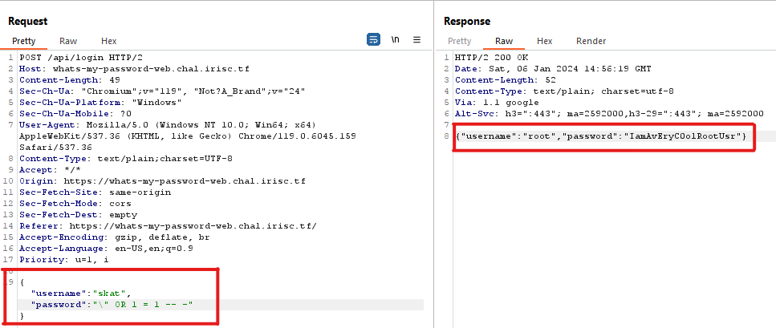
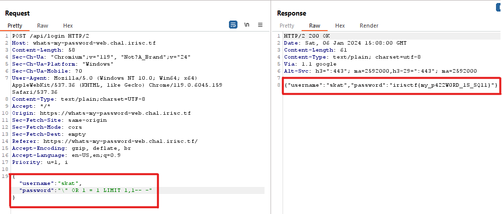
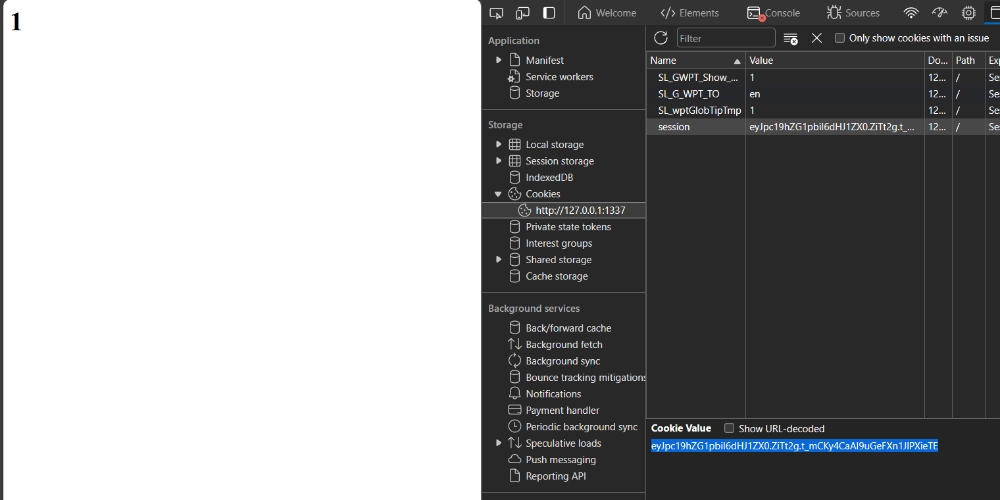
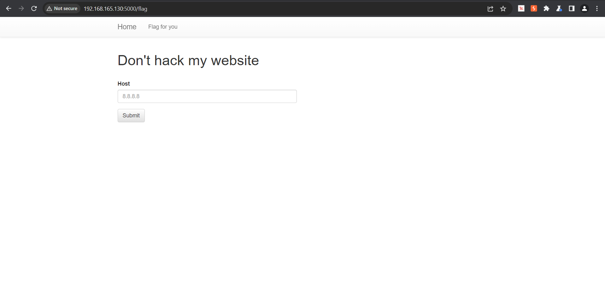
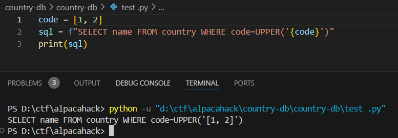

<!-- toc -->

- [2024](#2024)
  * [IrisCTF 2024](#irisctf-2024)
  * [Grey cat the flag 2024](#grey-cat-the-flag-2024)
  * [PTITCTF 2024](#ptitctf-2024)
  * [AlpacaHack](#alpacahack)

<!-- tocstop -->

# 2024
## IrisCTF 2024
1. What's My Password?

    Đề bài cho ta source code của trang web như sau:
    
    

    Từ source code và database đề bài cung cấp ta biết được khi đăng nhập đúng tài khoản thì trang web sẽ trả về một JSON gồm tài khoản và mật khẩu đã đăng nhập. Khi đăng nhập, server sẽ truy vấn tài khoản với câu lệnh ```SELECT * FROM users WHERE username = \"%s\" AND password = \"%s\"```.

    Từ database ta biết được flag là password của tài khoản ```skat```.
    
    

    Câu lệnh này đã có sự tham số hóa nhưng chưa triệt để khiến xuất hiện SQL injection. Tiến hành khai thác như sau:

    Vì ở trường ```Username``` đã bị filter các ký tự đặc biệt chỉ cho phép các ký tự thường và số nhưng ở ```Password``` thì không nên ta sẽ Injection vào đó:

    

    Thử với payload ```" OR 1 = 1 -- -``` kết quả trả về:

    

    Mặc dù mình đã đăng nhập với tài khoản ```skat``` nhưng kết quả trả về lại là tài khoản ```root``` đó là do câu lệnh truy vấn có mệnh để ```WHERE``` luôn đúng và lấy ra toàn bộ tài khoản nhưng server chỉ cho thấy kết quả đầu tiên. Vì database sử dụng MySQL nên sử dụng ```LIMIT 1,1``` để lấy ra kết quả cần thiết:

    

    flag: ```irisctf{my_p422W0RD_1S_SQl1}```
## Grey cat the flag 2024
1. Baby Web

    Đề bài cho ta source như sau

    

    Trang web xác thực người dùng bằng ```session``` với key là ```baby-web```, trang sẽ trả về flag khi người dùng admin ở trong session.

    Để đơn giản nhất, ta sửa lại đoạn code được cho như sau:

    

    Chạy và lấy được session có admin:

    

    Thay thế session vào web của chall:

    

    Xem HTML mà web trả về, ta thấy có đoạn mà web cho phép redirect sang ```/flag```

    

    Chuyển hướng URL đến ```/flag``` và tìm được flag:

    

    flag:```grey{0h_n0_mY_5up3r_53cr3t_4dm1n_fl4g}```
2. Grey survey
    
    * Chưa dựng lại được chall

    Challenge cho phép ta gửi lên một giá trị vote bắt buộc giá trị phải lớn hơn -1 và nhỏ hơn 1. 

    

    Để challenge trả về flag thì phải vote một giá trị sao cho phần nguyên của giá trị đó phải cộng với score lớn hơn 1 với score ban đầu được khởi tạo là ```-0.42069```. Tuy nhiên, giá trị này chỉ được phép nhỏ hơn 1 và lớn hơn -1 nên phần nguyên luôn bằng 0, không làm tăng score được. Lỗi nằm ở hàm lấy phần nguyên ```parseInt()``` của javascript, khi truyền giá trị ```0.0000001``` vào hàm này thì kết quả trả về bằng 1 thay vì bằng 0. Khi gửi giá trị vote ```0.0000001``` và nhận data trả về là score sau khi cộng thì đã có sự thay đổi, tiếp tục gửi một lần nữa và nhận được flag.

    flag: ```grey{50m371m35_4_l177l3_6035_4_l0n6_w4y}```

## PTITCTF 2024
1. Don't reverse

    Đề bài cho ta một trang web như sau và được biết flag nằm ở ```/flag.txt```:

    

    Chức năng: cho phép truyền vào một địa chỉ IP và trả về kết quả là ```PTITCTF2024```.

    

    Có vẻ như trang web đang xử lý dữ liệu liên quan đến địa chỉ IP (phỏng đoán là Ping). Vì chức năng chỉ trả về kết quả là  ```PTITCTF2024```dù đúng dù sai nên ta thử payload timebase ```8.8.8.8; sleep 5``` và thấy thời gian trả về cao hơn so với bình thường 5 giây:

    

    

    Flag nằm ở ```/flag.txt```, tiến hành kiểm tra flag có độ dài bao nhiêu bằng lệnh comand sau: 

    ```do_dai=$(cat ../flag.txt | wc -m);if [ $do_dai -lt 52 ]; then   sleep 5; fi```

    Thử dần và biết được flag dài 51 ký tự

    

    Thử kiểm tra chữ cái đầu tiên có phải ```P``` không bằng payload:

    ```chuoi=$(cat ../flag.txt | cut -c1);if [ "$chuoi" = "P" ]; then   sleep 5; fi```

    

    Tiến hành Intruder với payload 1 là từ vị trí từ 1 đến 51, payload 2 là các ký tự, số, và các ký hiệu:

    

    

    

    Ta nhận được kết quả:

    

    Vì chall này được dựng lại mà không có flag giống như trong cuộc thi nên ta nhận được flag test:

    ```PTITCTF{fake_flag_for_test}```
2. Còn một bài SSTI nhưng mất source :(

## AlpacaHack

1. Simple Login

    Đề bài cho ta một form login

    

    Và source code đằng sau và một số tài khoản để đăng nhập trong cơ sở dữ liệu:

    

    
    
    Trong burp suite ta có gói tin đăng nhập:

    

    Sau khi đăng nhập server trả về cho ta một cookie với value là username. Form đăng nhập đã loại bỏ dấu ```'``` để chống SQL injection nhưng không hoàn toàn. Thử payload với username là dấu slash ```\``` và password là ``` OR 1=1-- -```. Câu truy vấn trở thành ```SELECT * FROM users WHERE username = '\' AND password = ' OR 1=1-- -'```
    ở đây username sẽ thành chuỗi ```' AND password = ```, dấu slash đã biến dấu  ```'``` trong truy vấn trở thành một ký tự trong chuỗi username. Đương nhiên với điều kiện kèm ```OR 1=1``` thì sẽ lấy tất cả các tài khoản có trong cơ sở dữ liệu, theo đó tài khoản ```admin``` được lấy ở đầu và trả về cookie cho người dùng.

    

    Tuy nhiên, flag lại nằm ở bảng khác là bảng ```flag```. Ta tiến hành tấn công ```UNION  SELECT value, null FROM flag-- -``` để lấy ra flag làm username:

    

    Flag: ```Alpaca{SQLi_with0ut_5ingle_quot3s!}```

2. Treasure Hunt
    Bài cho ta một trang web chọn một icon hiển thị cho người dùng.

    

    Ở trong file cấu hình container Docker, flag được bằng cách má hóa nội dung flag thành một mã hash, mỗi kỹ tự thành một folder và chuỗi flag.txt cũng làm tương tự

    

    Có vẻ phải brute-force đường dẫn này, tên folder này nằm trong các ký tự ```1234567890abcdeflgtx```. Tuy nhiên, các ký tự ```f,l,a,g``` trong đường dẫn đều bị bỏ và báo lại status code 400

    

    Vì đây là url nên ta có thể thay thế nó bằng encode URL bằng mã Hex

    

    
    
    Tiến hành thử folder đầu tiên xem có sự khác nhau như thế nào giữa thư mục đúng với sai

    

    Có vẻ như ở thư mục đúng với ký tự thì nó rediect sang dường dẫn chứa trong thư mục đó

    

    Thiết lập mã khai thác như sau, với ban đầu path là ```flag = ''``` thử đường dẫn (path là biến tạm) với mỗi ký tự nếu trả về status 301 thì flag được cập nhật. Cho đến khi nhận được flag (status code  200) thì in ra màn hình.

    

    Flag: ```Alpaca{alpacapacapacakoshitantan}``` rất là wibu :v

3. CountryDB
    
    Bài cho ta một trang web tìm kiếm tên quốc gia theo mã cung cấp

    

    Source như sau:

    

    Database như sau:

    

    Mã nước được gửi đi dưới dạng JSON:

    

    Mã nước được lọc bằng cách nếu độ dài không bằng 2 hoặc có dấu nháy đơn thì trả về 400. Tuy nhiên, JSON cho phép gửi đi một mảng và hàm len() có thể tính cả độ dài mảng.

    

    Mã nước (code) được truyền vào lệnh SQL bằng F-string nên mã nước ta truyền vào một mảng thì nó được chuyển thành chuỗi:

    

    Tiến hành truyền tấn công SQLi bằng payload ```[1, ') UNION SELECT flag AS name FROM flag --']```:

    

    Flag: ```CakeCTF{b3_c4refUl_wh3n_y0U_u5e_JS0N_1nPut}```
# 2025
## KnightCTF2025

1. KnightConnect (Lỗ hổng bảo mật: token yếu và dễ đoán, whitebox)

    Challenge được xây dựng bằng Laravel, flag ở đây được truyền vào trong model, khi người dùng đăng nhập là admin thì mới được xem.

    

    Ở controller, ta thấy có 2 cách để đăng nhập vào hệ thống:

    - Cách đầu tiên là đăng nhập bằng username và password

    

    - Cách thứ 2 là sử dụng đường dẫn chứa token sinh từ một route của ứng dụng web:

    

    và route sinh đường dẫn đăng nhập :

    

    Nhận thấy được rằng token ở đây chỉ là mã hóa của email và thời gian sinh token nên dễ dàng có thể giả mạo token không sinh từ ứng dụng.

    Vậy, bây giờ phải đi tìm các email của admin để tiến hành giả mạo. Quan sát danh sách routes trong source, ta thấy có route ```/contact```

    

    Truy cập ```/contact``` thì ta nhận được một danh sách email của admin

    

    Tiến hành tạo một route từ source mà đề bài cho để lấy link đăng nhập với từng email vừa tìm được và với email ```nomanprodhan@knightconnect.com``` thì nhận được flag:

    

*Do chall đã đóng nên chỉ có thể nêu cách làm.*
